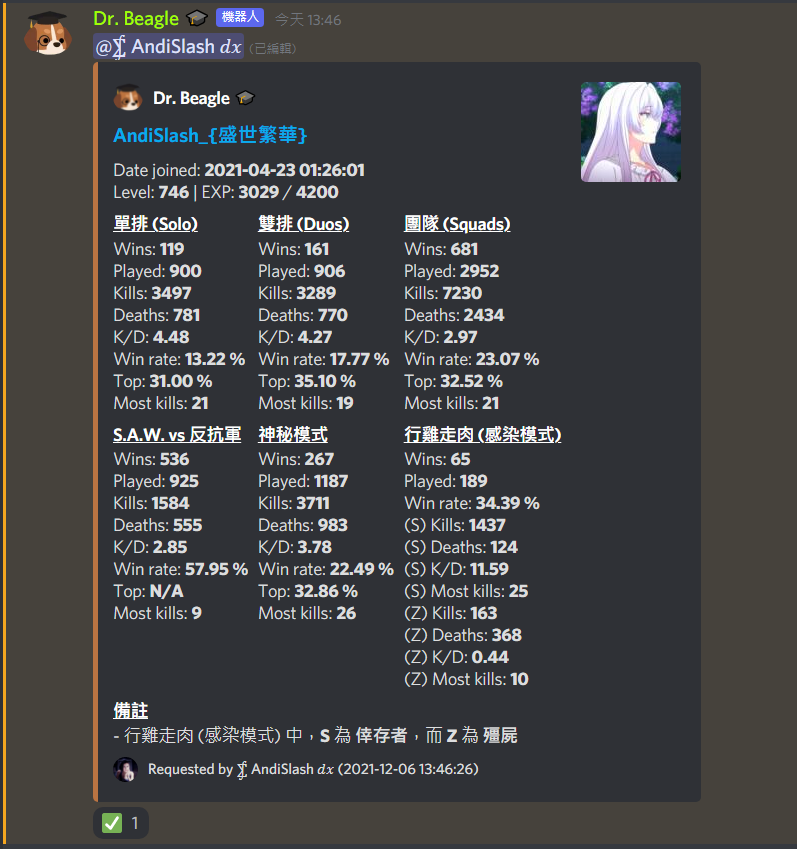
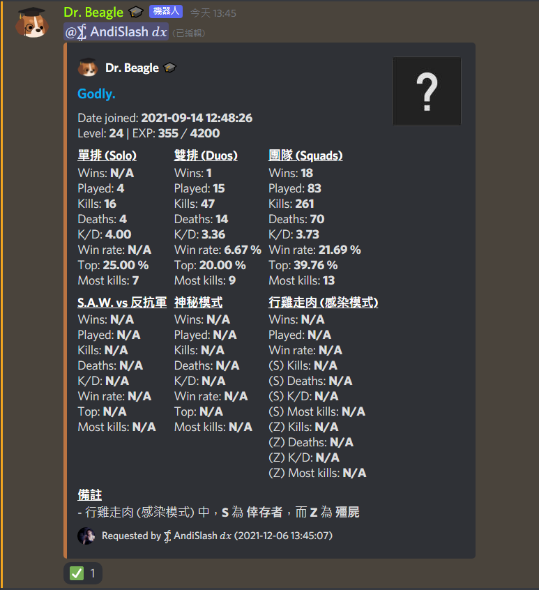

# DiscordBot-DrBeagle

My new Discord Bot with less function and clearer code layout

## Purpose

The main purpose of this bot is for **SAR player stats / data searching in Discord**

There are also some other commands but they're not the main point of this Discord Bot, so I'm not going to mention them in here.

## Examples




## Requirements

See [requirements.txt](./requirements.txt)

But some of them are **NOT** related to the SAR function of this bot.

Like:
```
numpy
opencv_python
qrcode
```

## Planned

### SAR command part
* [ ] Add language support & selection (Cantonese, English, Chinese)
* [ ] Add shop item displaying (Current & upcoming)